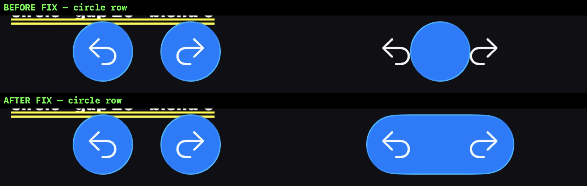

# Glass transitions, measured

What `CupertinoNativeGlassGroup`'s transitions actually do, on a running app,
rather than what the SwiftUI documentation says they should. Written after the
`glassEffectTransition` work on `feat/glass-effect-transitions`.

**This document was rewritten.** The first version of it claimed the merge was
verified and blamed a single cause — `spacing` doing double duty as both the
layout gap and the container's blend radius — for the merge not looking right.
Re-measuring at the user's insistence showed that claim was wrong: the blend
radius was never the problem, and the merge was producing the wrong *shape* for
a reason that had nothing to do with it. The correction is in
[What the first run got wrong](#what-the-first-run-got-wrong); the numbers below
are from the run that replaced it.

## Why this exists

The group had no `.glassEffectTransition` at all before this branch, and the
container it built changed identity with the spacing — so the merge was a state
and never a transition. Reading the Swift could tell us that fixing the
container might produce the effect; it could not tell us what the effect would
look like, and it could not tell us it would be *right*. Only a run does that.

## Method

A temporary probe entrypoint (`example/lib/glass_probe_main.dart`, deleted after
use) rendered a matrix: one row per configuration, column **A** with no
`unionId` and column **B** with one, so a single screenshot holds both states of
every configuration side by side. Above it, one group toggled its `unionId` on a
2s timer, to be recorded as motion.

Built with `flutter build ios --simulator --debug -t lib/glass_probe_main.dart`,
launched with `simctl`, screenshotted with `xcrun simctl io <UDID> screenshot`
and recorded with `... recordVideo` — **1284x2778, i.e. 428x926pt at scale 3, on
an iPhone 12 Pro Max, iOS 26.2**.

The screenshots were measured with a purpose-written scanner that finds
blue-dominant pixels and reports, per row band, the horizontal runs of glass. On
a 44pt item the glyph splits a glass into two runs, so runs are clustered with a
20px tolerance before being counted as one glass. The recordings were measured
with the same scanner applied per frame via `AVAssetImageGenerator` (there is no
`ffmpeg` on this machine).

`interactive: false` and a `systemBlue` tint throughout. All numbers are in
device pixels unless marked pt.

## The finding: a union needs a shape that fills its box

Two glasses, gap 20pt, blend 0, tinted blue on a dark page:

| item `shape` | A: no `unionId` | B: same `unionId` |
| --- | --- | --- |
| `circle` | two glasses, span 323px | **one glass, 130px** |
| `capsule` | two glasses, span 323px | **one glass, 322px** |
| `roundedRect` | two glasses, span 323px | **one glass, 322px** |

323px is 108pt — two 44pt items with a 20pt gap between them. Column A is
identical in all three rows, which is the control: with no union id, the shape
changes nothing and the two glasses stay two glasses.

In column B, `capsule` and `roundedRect` produce a single glass 322px wide —
the whole span, holding both icons. `circle` produces a glass **130px** wide,
i.e. 43pt: one item's worth, centred, with both icons left hanging outside it.

The arithmetic explains it. `glassEffectUnion` resolves the union's shape
against the union's **bounding box**, and a `Circle` is *inscribed* in whatever
frame it is handed. Inscribed in 108x44 that is a 44pt circle. `Capsule` and
`RoundedRectangle` fill their frame instead, so they span it.

Left of each pair has no `unionId`; right has one. Top: before the fix, the
union is a single 44pt circle with both icons outside it. Bottom: after, it
spans the group and holds them.

This is also why Apple's own `glassEffectUnion` examples work: `.glassEffect()`
with no shape argument defaults to `Capsule`, and a circle has to be asked for
deliberately. The fix is the same conclusion — **an item that shares its union
id with another is drawn as a capsule**, whatever `shape` says. On a square item
a capsule *is* a circle, so a lone glass is unaffected; `roundedRect` is still
honoured, since it fills its frame too.

After the fix, the `circle` row's column B measures 322px like the others.

### The blend radius is a separate question, and was not the bug

`spacing` used to set both the layout gap and the container's blend radius.
`mergeDistance` now sets the radius on its own. Measuring column A across blend
values showed the radius was **never** merging the two glasses by proximity:

| row | A: glass span, gap 20 | A: glass span, gap 4 |
| --- | --- | --- |
| blend `0` | 323px, 61px gap | 276px, 14px gap |
| blend `= gap` | 323px, 61px gap | 276px, 14px gap |

61px is 20.3pt and 14px is 4.7pt — the requested gaps, in both blend settings.
Two separate glasses stayed separate even when the container's radius equalled
the gap between them, which matches Apple's wording: the container blends
effects that are *nearer than* its spacing, not equally far apart.

So `mergeDistance` is a real and useful control — it is what makes a union
testable in isolation — but it was not the cause of anything. See the correction
below.

## The transitions themselves

Recorded over 10.8s with the union id toggling every 2s. Per frame: how many
separate glasses are on screen, and the widest gap between them.

**2 → 1 (merge).** Three times, at t=0.99, 5.15 and 9.02. The one at t=0.99:

| t | glasses | span | widest gap |
| --- | --- | --- | --- |
| 0.89 | 2 | 323px | 61px |
| 0.99 | 1 | 131px | — |
| 1.09 | 1 | 237px | — |
| 1.19 | 1 | 303px | — |
| 1.29 | 1 | 319px | — |
| 1.39 | 1 | 322px | — |

**1 → 2 (split).** Twice, at t=3.17 and 7.13. The one at t=3.17:

| t | glasses | span | widest gap |
| --- | --- | --- | --- |
| 2.97 | 1 | 323px | — |
| 3.07 | 1 | 288px | — |
| 3.17 | 2 | 315px | 39px |
| 3.27 | 2 | 322px | 57px |
| 3.37 | 2 | 323px | 60px |
| 3.47 | 2 | 323px | 62px |

Both directions animate, over roughly 0.4s, which is the
`withAnimation(.smooth(duration: 0.35))` on the Swift side.

Reading the frames rather than the numbers: on the merge, the left glass
stretches rightwards and swallows the right one, which shrinks away; on the
split, the pill contracts and the second glass separates out and grows, with its
icon fading up. Neither is a cross-fade — the shapes genuinely interpolate.

Two details worth knowing, both visible in the numbers:

- **The merge passes through a narrow state.** At t=0.99 there is one glass only
  131px wide, i.e. narrower than the two glasses it replaced. The union does not
  grow outwards from two shapes; it appears at one item's width and expands.
  Visible in a frame-by-frame look as a brief moment where the right icon is a
  sliver at the pill's edge. It reads as a merge, but it is not Apple's
  two-shapes-reaching-for-each-other.
- **The split starts by shrinking.** 323px to 288px before the second glass
  appears, so the pill contracts slightly before it divides.

## What the first run got wrong

The first version of this document said the merge was verified and that the
confound was `spacing` doubling as gap and blend radius, making the two states
only 4pt apart. Both halves were wrong.

- The two states were never 4pt apart. They were 61px apart in every
  configuration measured, and the container was not blending them by proximity
  at any blend setting (table above).
- The merge *did* happen — the union was working. What was wrong was the shape
  it produced, which the first run never measured because it only measured
  whether a union formed, not how wide it was. A single 130px glass was recorded
  as "a single continuous silhouette" and taken as success.

The lesson is in the measurement, not the mechanism: "one shape instead of two"
is not the same claim as "one shape of the right size", and the first run only
tested the first. The matrix in this run exists because of that — it puts both
states in one frame, so a wrong width cannot be read as a right one.

## What this does not prove

- **The simulator is not the device.** Refraction and edge lighting are
  simplified here; what was verified is geometry and timing, not optical
  fidelity. A device still has to confirm the glass *looks* right.
- **The label and the glass are composited separately.** Any Flutter-drawn label
  can lead or trail the native glass by a frame, so a step boundary should be
  read from several consecutive frames rather than one.
- **Not exercised:** the `identity` transition, `vertical: true`, `glassVisible`
  on a multi-item group, a union of three or more items, unions of mixed shapes,
  and animating `spacing` at runtime.
- **`roundedRect` unions were measured in one configuration only** — radius 16,
  gap 20. Its union width matched the capsule's, but the corner behaviour was
  not looked at closely.
- `interactive: false` throughout, so the touch shimmer is not covered.
